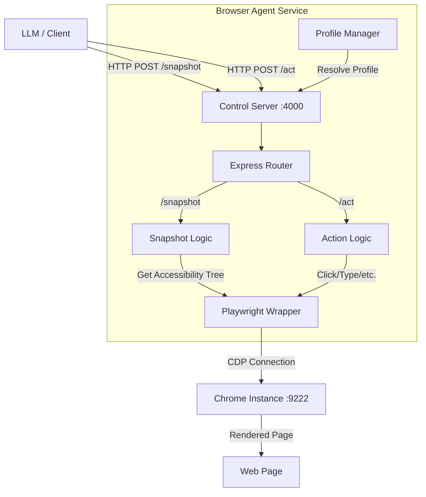

# OpenClaw Browser Agent Documentation

## Overview

The **OpenClaw Browser Agent** is a specialized service designed to allow Large Language Models (LLMs) to interact with a web browser. Unlike standard automation tools that rely on brittle selectors (CSS/XPath), this agent exposes the web page as a **Semantic Accessibility Tree**.

This approach provides two key benefits:
1.  **Token Efficiency**: The LLM receives a concise, meaningful representation of the page (buttons, inputs, text) rather than thousands of lines of raw HTML.
2.  **Reliability**: Elements are assigned stable Reference IDs (e.g., `[ref=e12]`) which the LLM uses to perform actions.

## Architecture

The system consists of a Control Server (Express) that translates HTTP requests into Playwright commands via the Chrome DevTools Protocol (CDP).



## Configuration

Configuration is loaded from environment variables or a configuration file.

| Variable | Default | Description |
| :--- | :--- | :--- |
| `PORT` | `4000` | Port for the Control Server. |
| `HEADLESS` | `false` | Whether to run the browser in headless mode. |
| `evaluateEnabled` | `true` | Security flag to enable/disable arbitrary JS execution. |

## API Reference

All responses return JSON. Errors return a non-200 status code with `{ "ok": false, "error": "message" }`.

### 1. Snapshot (`POST /snapshot`)

Retrieves the current state of the page as a semantic tree.

**Request Body:**
```json
{
  "targetId": "optional-tab-id",
  "timeoutMs": 5000,
  "maxChars": 10000,
  "interactiveOnly": false,
  "compact": false,
  "maxDepth": 10
}
```

*   `interactiveOnly`: If `true`, returns only clickable/input elements (saves tokens).
*   `compact`: Removes structural containers (divs/groups) that don't have names.

**Response:**
```json
{
  "ok": true,
  "targetId": "1234.1",
  "url": "https://example.com",
  "snapshot": "- button "Login" [ref=e12]
- textbox "Username" [ref=e13]",
  "refs": {
    "e12": { "role": "button", "name": "Login" },
    "e13": { "role": "textbox", "name": "Username" }
  }
}
```

The `snapshot` field is what you feed to the LLM. The `refs` map is for internal use/verification.

### 2. Act (`POST /act`)

Performs an interaction on the page.

**Common Request Parameters:**
*   `targetId`: Target specific tab (optional).
*   `timeoutMs`: Operation timeout.

#### Supported Actions (`kind`)

**a. Click**
```json
{
  "kind": "click",
  "ref": "e12",
  "button": "left", // left | right | middle
  "modifiers": ["Shift"], // Alt | Control | Meta | Shift
  "doubleClick": false
}
```

**b. Type**
```json
{
  "kind": "type",
  "ref": "e13",
  "text": "myuser",
  "submit": true, // Press Enter after typing
  "slowly": false
}
```

**c. Press Key**
```json
{
  "kind": "press",
  "key": "Enter" // or "ArrowDown", "c", etc.
}
```

**d. Hover**
```json
{
  "kind": "hover",
  "ref": "e12"
}
```

**e. Scroll**
```json
{
  "kind": "scrollIntoView",
  "ref": "e50"
}
```

**f. Navigate**
```json
{
  "kind": "navigate",
  "url": "https://google.com"
}
```

**g. Wait**
Waits for a condition to be met.
```json
{
  "kind": "wait",
  "timeMs": 1000, // Fixed sleep
  "text": "Success", // Wait for text to appear
  "textGone": "Loading", // Wait for text to disappear
  "selector": ".my-class", // Wait for CSS selector
  "loadState": "networkidle" // load | domcontentloaded | networkidle
}
```

**h. Evaluate (JS)**
Executes arbitrary JavaScript (requires `evaluateEnabled: true`).
```json
{
  "kind": "evaluate",
  "fn": "() => document.title",
  "ref": "e12" // Optional: passes element as argument
}
```

### 3. Screenshots

**a. Standard Screenshot (`POST /screenshot`)**
```json
{
  "ref": "e12", // Optional: Element screenshot
  "fullPage": false,
  "type": "png"
}
```
Returns: `imageBase64`

**b. Labeled Screenshot (`POST /screenshot/labeled`)**
Overlays bounding boxes and labels on the image for Visual LLMs.
```json
{
  "refs": { "e1": { "role": "button" } },
  "maxLabels": 100
}
```

### 4. Special Hooks

**a. File Upload (`POST /hooks/file-chooser`)**
Handles file picker dialogs.
```json
{
  "paths": ["/tmp/file.txt"],
  "ref": "e15" // Optional: Click this button to trigger the dialog
}
```

**b. Dialogs (`POST /hooks/dialog`)**
Handles JS Alerts/Confirms.
```json
{
  "accept": true,
  "promptText": "input text" // For window.prompt
}
```

## Data Types

### RoleRefMap
Returned in `/snapshot`, this maps IDs to their semantic meaning.
```typescript
type RoleRefMap = Record<string, {
  role: string;
  name?: string;
  nth?: number; // Index if there are duplicates
}>;
```

### Snapshot String Format
The snapshot is a tree structure where indentation represents hierarchy.
```text
- heading "Welcome" [ref=e1]
  - link "Home" [ref=e2]
  - button "Logout" [ref=e3]
```

## Workflow Example

1.  **Start Session**: `POST /act { "kind": "navigate", "url": "https://example.com" }`
2.  **Observe**: `POST /snapshot { "interactiveOnly": true }`
3.  **Think (LLM)**: "I see a login button [ref=e5]. I should click it."
4.  **Act**: `POST /act { "kind": "click", "ref": "e5" }`
5.  **Wait**: `POST /act { "kind": "wait", "loadState": "networkidle" }`
6.  **Loop**: Go back to step 2.
