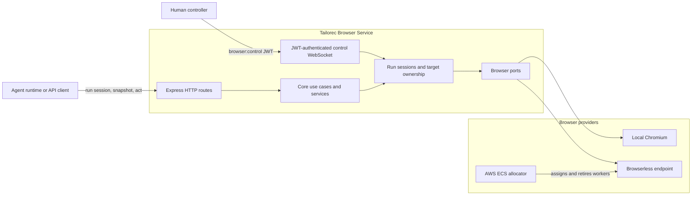

# Tailorec Browser Service

<p align="center">
  
</p>

A run-isolated browser control service for agentic workflows. It turns web pages into semantic snapshots with stable element references, executes browser actions through HTTP, and supports either local Chromium or remote Browserless workers.

The service owns browser mechanics. It does not decide what an agent should do.

## Why this service exists

Raw DOM selectors are brittle in modern applications. Tailorec Browser Service gives callers a smaller, auditable contract:

1. create a run-owned browser session
2. navigate to a page
3. take a semantic snapshot
4. act on a returned reference such as `e12`
5. take a fresh snapshot after the page changes
6. close the run session

Each `run_id` owns its browser session and active `targetId`. Cross-run target access fails closed instead of falling back to an arbitrary tab.

## Capabilities

- Semantic accessibility snapshots with stable, action-ready refs
- Click, type, fill, select, drag, wait, evaluate, navigation, and blocker actions
- Run-scoped session and tab ownership with idempotent session creation
- Local Chromium and remote Browserless providers
- Optional on-demand Browserless worker allocation on AWS ECS/Fargate
- Screenshots, labeled screenshots, file uploads, downloads, and dialog hooks
- JWT-scoped WebSocket control for human takeover
- Structured correlation logs and provider/allocator diagnostics
- Unit, integration, contract, and Playwright end-to-end test suites

## Architecture



The code follows a ports-and-adapters layout: domain logic in `src/core` does not import Express, Playwright, Chrome, or AWS SDK implementations. See [Architecture](./docs/architecture/overview.md) for lifecycle and trust-boundary diagrams.

## Quick start

Requirements: Node.js 20+, npm, and a Chromium-compatible runtime.

```bash
npm ci
npx playwright install chromium
cp .env.example .env
npm run dev
```

In another terminal, run a complete session:

```bash
# 1. Create a run-owned browser session.
curl -sS -X POST http://127.0.0.1:4000/runs/demo-run/session

# 2. Navigate. Every browser operation includes run_id.
curl -sS -X POST http://127.0.0.1:4000/act \
  -H 'Content-Type: application/json' \
  -d '{"run_id":"demo-run","kind":"navigate","url":"https://example.com"}'

# 3. Read the page and collect refs.
curl -sS -X POST http://127.0.0.1:4000/snapshot \
  -H 'Content-Type: application/json' \
  -d '{"run_id":"demo-run","interactiveOnly":true,"compact":true}'

# 4. Release the browser runtime when the workflow ends.
curl -sS -X DELETE http://127.0.0.1:4000/runs/demo-run/session
```

Use a ref returned by `/snapshot` in a later action:

```bash
curl -sS -X POST http://127.0.0.1:4000/act \
  -H 'Content-Type: application/json' \
  -d '{"run_id":"demo-run","kind":"click","targetId":"TARGET_ID","ref":"e12"}'
```

Refs may become stale after navigation or a meaningful DOM update. Snapshot again before the next decision.

## Providers

| Provider | Use case | Required configuration | Runtime behavior |
|---|---|---|---|
| `local` | Development, CI, trusted single-host deployments | Playwright Chromium; optional `BROWSER_CDP_PORT` | Launches a run-owned local Chromium runtime |
| `browserless` | Hosted Chrome or Browserless deployments | `BROWSER_ENDPOINT` | Pins each run to a remote browser connection |
| `browserless` + ECS allocator | Elastic production workers | Browserless endpoint template plus ECS cluster, task, subnet, and security-group settings | Assigns capacity, waits for readiness, quarantines failed workers, and stops idle workers |

Only one provider may be configured in a process. See [Configuration](./docs/getting-started/configuration.md) and [Browserless operations](./docs/operations/browserless.md).

## API at a glance

| Area | Endpoints |
|---|---|
| Health | `GET /`, `GET /status` |
| Run lifecycle | `POST /runs/:runId/session`, `DELETE /runs/:runId/session` |
| Page state | `POST /snapshot`, `POST /snapshot/delta` |
| Actions | `POST /act` |
| Uploads/downloads | `POST /hooks/file-chooser`, `POST /hooks/dialog`, `POST /wait/download`, `POST /download` |
| Media | `POST /screenshot`, `POST /screenshot/labeled`, `POST /highlight` |
| Human control | `GET /control`, `WS /control/live` |

Execution endpoints require a `run_id` in their JSON body. The session must already exist. See the [API reference](./docs/api-reference/overview.md).

## Security model

`/control` and `/control/live` verify a short-lived HS256 JWT with the expected issuer, audience, token type, and `browser:control` scope. The regular execution endpoints do not implement application-level authentication, so expose this service only on a private network or behind an authenticated gateway. Never publish a raw Browserless endpoint or token.

See [Security policy](./SECURITY.md) for reporting and deployment guidance.

## Development

```bash
npm run check
npm run test
npm run test:unit
npm run test:integration
npm run test:contract
npm run test:gate:run-isolation
npm run test:e2e
```

Build and run the compiled service:

```bash
npm run build
npm start
```

Container images:

```bash
# Remote Browserless runtime; no browser bundled.
docker build -t tailorec-browser .

# Local runtime; Playwright Chromium bundled.
docker build -f Dockerfile.local -t tailorec-browser-local .
```

## Documentation

- [Documentation index](./docs/README.md)
- [Quick start](./docs/getting-started/quickstart.md)
- [Configuration reference](./docs/getting-started/configuration.md)
- [Architecture and design decisions](./docs/architecture/overview.md)
- [API reference](./docs/api-reference/overview.md)
- [Browserless operations](./docs/operations/browserless.md)
- [Testing guide](./docs/testing/overview.md)
- [Contributing](./CONTRIBUTING.md)

## Current constraints

- Runtime ownership state is process-local. Do not expect active runs to survive a process restart.
- A run supports one active non-blank tab in the current isolation model. Unsupported extra-tab flows return `409` and close the run session.
- Capacity is bounded. Admission failures return `429`, `Retry-After`, and machine-readable capacity details.
- A disconnected remote session becomes degraded and fails with `503`; callers must create a new run rather than silently rebind the old one.
- `/status` returns diagnostics and redacts endpoint credentials, but it is not an external provider health probe.

## License

This repository does not currently contain a license file. Until the maintainers add one, copyright law reserves all rights and third-party reuse is not granted.
