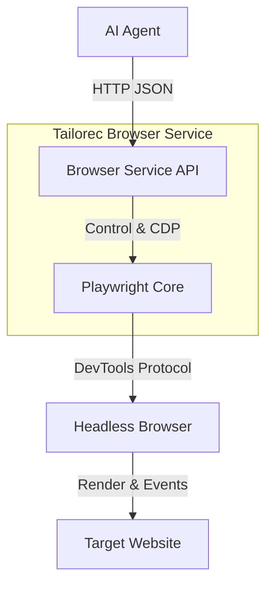
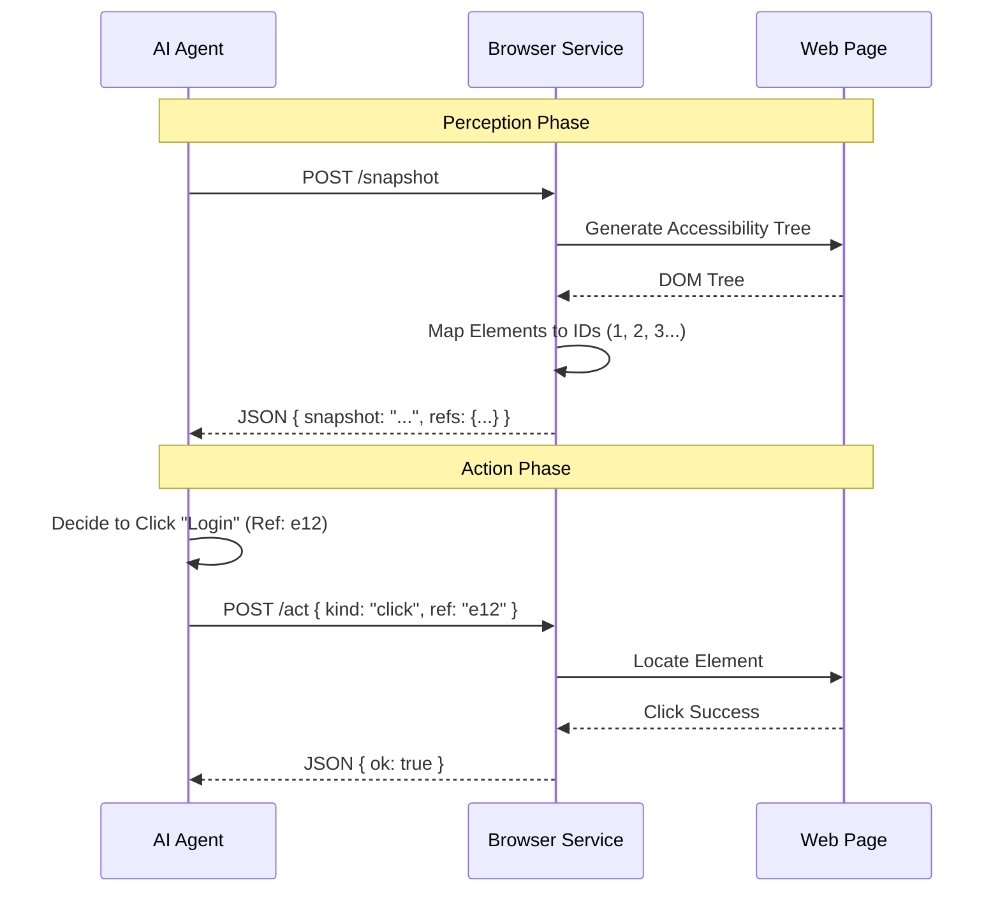
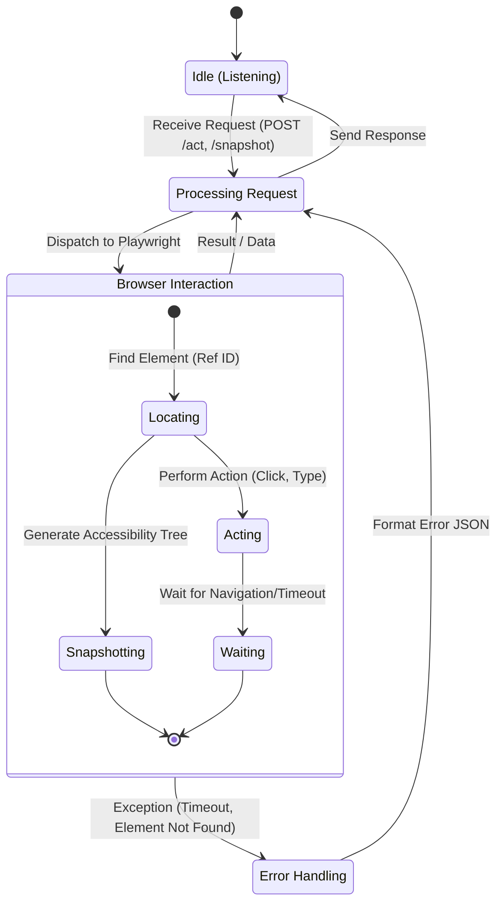

# Tailorec Browser Service

Tailorec Browser Service is a specialized, standalone HTTP service designed to act as the "hands and eyes" for AI agents. It wraps **Playwright** in a high-level REST API, allowing external agents to programmatically control a web browser, perceive its state via accessibility snapshots, and perform complex interactions without embedding a full browser stack into the agent's process.

## 🏗 Architecture

The service sits between your AI Agent and the target website. It translates high-level intents (e.g., "click button 42") into low-level Playwright commands.



### Dataflow & Interaction Model

The interaction model follows a **Perceive-Act** loop:

1.  **Perceive**: The agent requests a snapshot. The service returns a simplified, accessibility-focused text representation of the page, where interactive elements are assigned stable ref IDs (e.g., `e12`).
2.  **Act**: The agent sends a command referencing those IDs (e.g., `click(ref=e12)`).



## 🚀 Getting Started

### Prerequisites

-   Node.js v18+
-   Playwright browsers installed

### Installation

```bash
# Install dependencies
npm install

# Install Playwright browsers
npx playwright install chromium
```

### Running the Service

```bash
# Run in development mode (hot reload)
npm run dev

# Build and run production
npm run build
npm start
```

The service typically listens on port **4000** (or as configured).

## 🔄 Service State Machine

The service operates as a stateless REST API from the client's perspective, but internally manages persistent browser sessions.



## 🔌 API Reference

### 1. System Status
**`GET /status`**
Checks if the service is running and lists active profiles.

### 2. Perception (`/snapshot`)
**`POST /snapshot`**
Generates a text-based representation of the current page state for the AI to analyze.

**Body:**
```json
{
  "targetId": "optional-page-id",
  "timeoutMs": 5000,
  "maxChars": 10000
}
```

**Response:**
```json
{
  "ok": true,
  "snapshot": "- button \"Submit\" [ref=e12]\n- textbox \"Search\" [ref=e45]...",
  "refs": {
    "e12": { "role": "button", "name": "Submit" },
    "e45": { "role": "textbox", "name": "Search" }
  }
}
```

### 3. Actions (`/act`)
**`POST /act`**
Executes interactions on the page. All actions require a `kind` field.

#### Supported Actions

| Kind | Required Fields | Description |
|------|----------------|-------------|
| `click` | `ref` | Clicks an element by its ID. |
| `type` | `ref`, `text` | Types text into an input field. |
| `press` | `key` | Presses a keyboard key (e.g., "Enter", "ArrowDown"). |
| `scrollIntoView` | `ref` | Scrolls an element into view. |
| `hover` | `ref` | Hovers over an element. |
| `navigate` | `url` | Navigates the current tab to a URL. |
| `wait` | *various* | Waits for time, text, or network idle. |
| `evaluate` | `fn` | Executes JavaScript in the page context. |
| `drag` | `startRef`, `endRef` | Drags one element to another. |
| `fill` | `fields` | Fills multiple form fields at once. |

**Example Request (Click):**
```json
{
  "kind": "click",
  "ref": "e12",
  "timeoutMs": 2000
}
```

**Example Request (Type):**
```json
{
  "kind": "type",
  "ref": "e45",
  "text": "Hello World",
  "submit": true
}
```

### 4. Browser Hooks & Utilities

-   **`POST /hooks/file-chooser`**: Handle file upload dialogs.
-   **`POST /hooks/dialog`**: Handle JavaScript alerts/prompts.
-   **`POST /download`**: Trigger and wait for a file download.
-   **`POST /wait/download`**: Wait for a download initiated by a previous action.
-   **`POST /highlight`**: Highlight an element by `ref` for debugging.

### 5. Visual Preview (Screenshots)

Use these endpoints to provide user-visible previews of browser actions.

#### `POST /screenshot`
Capture a screenshot and return it as base64.

**Body:**
```json
{
  "targetId": "optional-page-id",
  "type": "png",
  "fullPage": false,
  "ref": "e12"
}
```

- `type`: `png` (default) or `jpeg`
- `ref` or `element` can be provided for element screenshots
- `fullPage` is supported only for full-page screenshots (not element screenshots)

**Response:**
```json
{
  "ok": true,
  "targetId": "...",
  "url": "https://...",
  "mimeType": "image/png",
  "imageBase64": "iVBORw0KGgo..."
}
```

#### `POST /screenshot/labeled`
Capture a screenshot with visible ref labels overlaid for debugging.

**Body:**
```json
{
  "targetId": "optional-page-id",
  "type": "png",
  "maxLabels": 120,
  "refs": {
    "e1": { "role": "button", "name": "Apply" },
    "e2": { "role": "textbox", "name": "Email" }
  }
}
```

**Response:**
```json
{
  "ok": true,
  "targetId": "...",
  "url": "https://...",
  "mimeType": "image/png",
  "labels": 36,
  "skipped": 8,
  "imageBase64": "iVBORw0KGgo..."
}
```

## 📂 Project Structure

```
src/
├── browser/           # Core browser logic
│   ├── routes/        # Express API route definitions
│   ├── pw-ai.ts       # Main AI integration layer
│   ├── pw-session.ts  # Playwright session management
│   └── server.ts      # Browser server entry point
├── infra/             # Infrastructure utilities (WS, Errors)
├── logging/           # Logging subsystem
├── server.ts          # Main application entry point
└── utils/             # General helper functions
```

## 🛠 Configuration

Configuration is loaded via `src/browser/config.ts`. You can control:
-   **Port**: `PORT` (default `4000`)
-   **Headless**: `BROWSER_HEADLESS=true|false` (preferred, legacy `HEADLESS` also supported)
-   **Viewport**: `BROWSER_VIEWPORT=WIDTHxHEIGHT` (default `1280x720`, e.g. `1280x720`)
-   **Evaluate Enabled**: Security toggle to allow/disallow arbitrary JS execution.

Example:

```bash
PORT=4000
BROWSER_HEADLESS=true
BROWSER_VIEWPORT=1280x720
```
