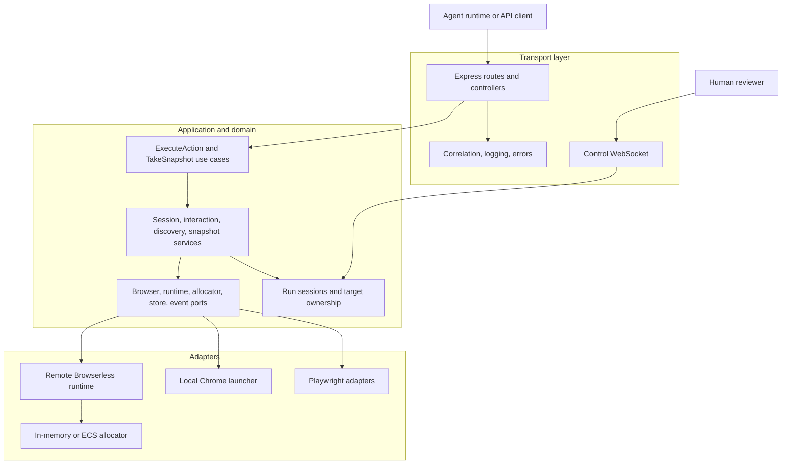
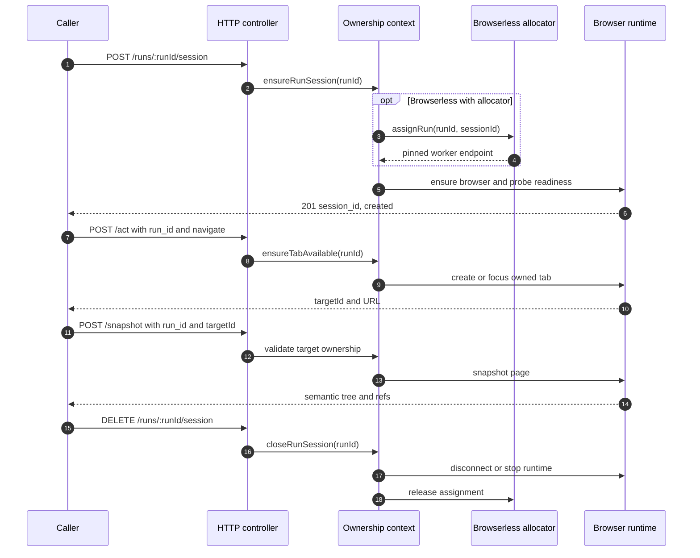
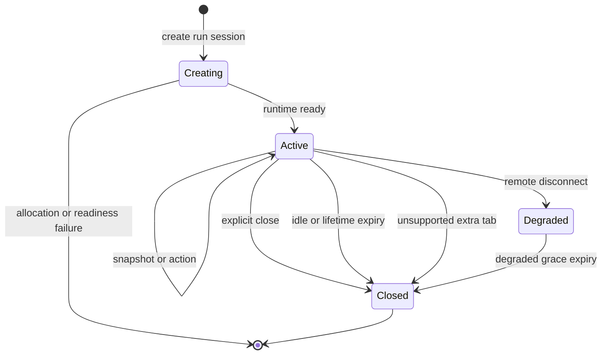
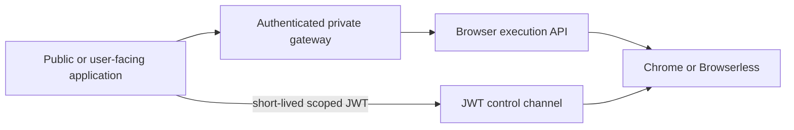

# Architecture

Tailorec Browser Service isolates browser mechanics behind a run-scoped HTTP contract. Agent reasoning stays outside the service; session ownership, browser execution, and observable failures stay inside it.

## Component boundaries

Dependencies point inward. `src/core` defines entities, ports, services, and use cases. `src/api` translates HTTP into those operations. `src/adapters` implements Express, Playwright, Chrome, logging, and AWS behavior. `src/container` is the composition root.

## Run lifecycle

Session creation is idempotent for an active run. Browser operations are not. Use `idempotencyKey` when a `navigate` request intentionally creates a new tab and may be retried.

## Isolation state machine

The ownership context maintains `runSessions` and `targetOwners` maps in process memory. It rejects:

- a run bound to a different profile
- a target owned by another run
- browser use before session creation
- extra non-blank tabs in the current single-tab model
- actions on degraded sessions

This fail-closed behavior prevents a retry or stale caller from controlling an unrelated page.

## Provider model

### Local

Each run gets a reserved loopback port and a local browser runtime. Local admission defaults to five active sessions. This provider is intended for development, CI, and trusted single-host deployments.

### Browserless

Each run gets a dedicated remote browser connection. With only `BROWSER_ENDPOINT`, the in-memory allocator tracks capacity against that provider. With complete ECS configuration, the allocator launches or reuses owned Fargate tasks, waits for ECS and browser readiness, pins runs to workers, quarantines unavailable workers, reconciles tagged orphans on startup, and retires idle workers.

## Trust boundaries

Only the human-control channel authenticates requests inside this service. HTTP execution routes assume a trusted network caller. Production deployments must enforce authentication, authorization, rate limits, and request-size policy at the gateway or service mesh.

Control JWTs use HS256 and require `exp`, the configured issuer/audience, `token_type=agent_browser_control`, and `browser:control` scope. A newer control socket for the same `run_id` replaces the older one.

## Failure semantics

| Failure | Response | Caller behavior |
|---|---|---|
| Invalid input or missing `run_id` | `400` | Correct the request; do not retry unchanged |
| Unknown profile or target | `404` | Refresh state or fix configuration |
| Ownership conflict or unsupported extra tab | `409` | Stop the flow and create a correctly scoped run |
| Capacity exhausted | `429` with `Retry-After` | Back off, then retry session creation |
| Disabled evaluation | `403` | Remove code evaluation or enable it deliberately |
| Remote runtime unavailable/degraded | `503` | Close or abandon the run; create a new run after recovery |

## Trade-offs

- Process-local ownership is simple and fast, but active sessions do not survive restart and multiple service replicas need external affinity or shared ownership.
- A single active tab makes ownership easy to prove, but popup and multi-tab workflows are intentionally rejected.
- Semantic refs are more stable than arbitrary selectors, but callers must snapshot again after state changes.
- ECS worker ownership gives explicit capacity and cleanup, but adds AWS permissions, readiness latency, and control-plane failure modes.

## Source map

| Concern | Source |
|---|---|
| Composition and startup | `src/main.ts`, `src/container/container.ts` |
| HTTP contract | `src/api/routes`, `src/api/controllers` |
| Ownership and lifecycle | `src/api/context/browser.context.ts` |
| Domain behavior | `src/core` |
| Playwright execution | `src/adapters/playwright` |
| Local/remote runtimes | `src/adapters/browser` |
| Control authentication | `src/shared/utils/control-token.ts`, `src/adapters/http/control-live.server.ts` |

See [Run sessions](../api-reference/run-sessions.md), [Browserless operations](../operations/browserless.md), and [Testing](../testing/overview.md).
