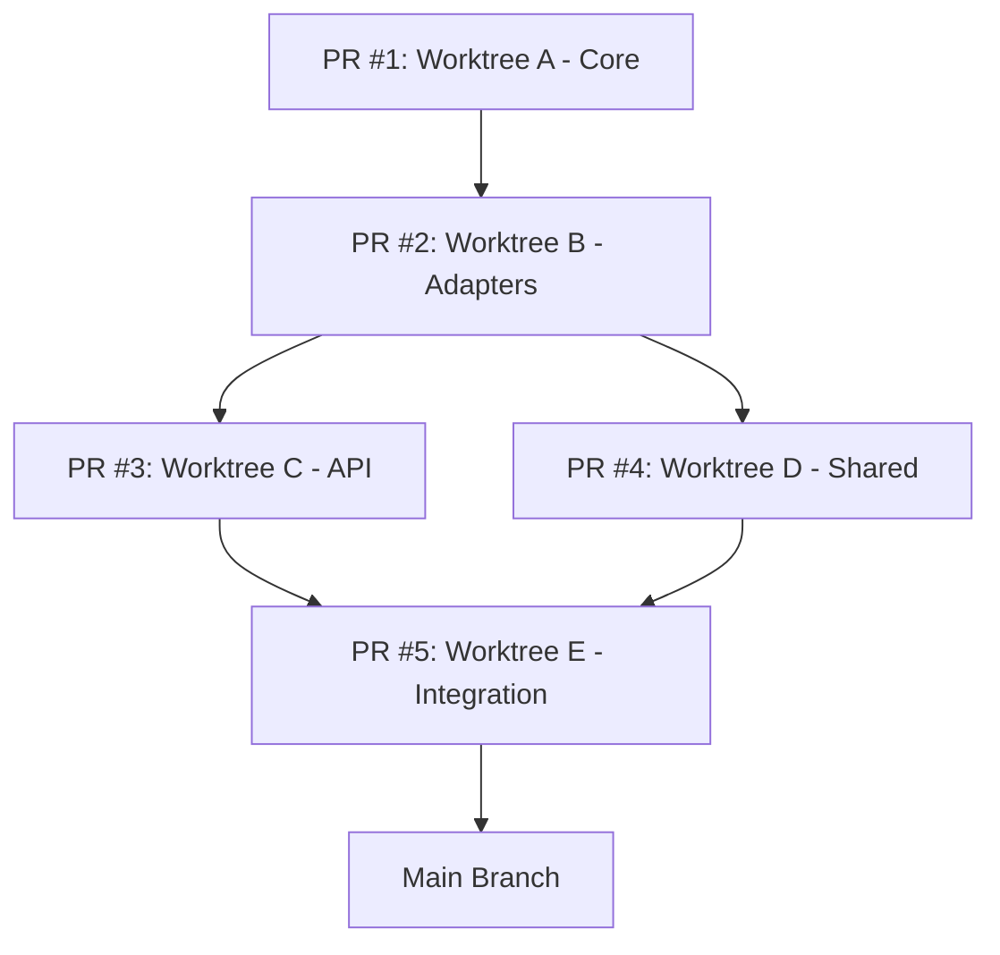

# 🏗 Codebase Refactoring Plan

**Project:** Tailorec Browser Service  
**Architecture:** Clean Architecture (Hybrid Approach)  
**Strategy:** Parallel Worktrees (5 branches)  
**Goal:** Modular, maintainable codebase with max 500-700 lines per file

---

## 📋 Executive Summary

### Current State

| Metric | Value |
|--------|-------|
| Total source files | ~36 files in `src/browser/` |
| Largest file | `pw-tools-core.interactions.ts` (1298 lines) |
| Files > 500 lines | 4 files |
| Average file size | ~220 lines |
| Architecture | Layered (routes, browser, infra, logging) |

### Target State

| Metric | Target |
|--------|--------|
| Total source files | ~70-80 files |
| Largest file | ≤ 700 lines |
| Files > 500 lines | 0 files |
| Average file size | ~150 lines |
| Architecture | Clean Architecture (Core, Adapters, API, Shared) |

---

## 🎯 Refactoring Objectives

### Primary Goals

1. **Reduce file complexity** — No file exceeds 700 lines
2. **Improve separation of concerns** — Clear boundaries between domain, application, infrastructure
3. **Enhance testability** — Each module independently testable
4. **Maintain functionality** — Zero breaking changes to API contracts
5. **Preserve test coverage** — Maintain or improve current coverage levels

### Non-Goals

- ❌ No new features during refactoring
- ❌ No API contract changes (backward compatible)
- ❌ No performance optimizations (focus on structure only)
- ❌ No dependency upgrades (do separately)

---

## 🌳 Worktree Strategy

### Overview

```
openclaw-browser/              # Main repository (main branch)
├── refactor/worktree-a-core/  # Worktree A: Core Domain Layer
├── refactor/worktree-b-adapters/  # Worktree B: Infrastructure Adapters
├── refactor/worktree-c-api/   # Worktree C: API Layer
├── refactor/worktree-d-shared/  # Worktree D: Shared & Config
└── refactor/worktree-e-integration/  # Worktree E: Integration & Cleanup
```

### Worktree Summary

| Worktree | Branch Name | Focus Area | Files Changed | Est. Time | Priority |
|----------|-------------|-----------|---------------|-----------|----------|
| **A** | `refactor/worktree-a-core` | Core domain entities, services, ports | ~20 files | 2-3 days | 🔴 P0 |
| **B** | `refactor/worktree-b-adapters` | Playwright, Chrome, HTTP adapters | ~25 files | 3-4 days | 🔴 P0 |
| **C** | `refactor/worktree-c-api` | Controllers, routes, validators, middleware | ~20 files | 2-3 days | 🟡 P1 |
| **D** | `refactor/worktree-d-shared` | Shared utils, errors, config, container | ~15 files | 1-2 days | 🟡 P1 |
| **E** | `refactor/worktree-e-integration` | Integration tests, cleanup, docs | ~10 files | 2-3 days | 🟢 P2 |

---

## 📁 Target Architecture

```
src/
├── core/                      # Domain + Application (merged)
│   ├── entities/              # Pure data objects
│   │   ├── browser-session.entity.ts
│   │   ├── tab.entity.ts
│   │   ├── profile.entity.ts
│   │   └── index.ts
│   │
│   ├── services/              # Business logic
│   │   ├── snapshot.service.ts
│   │   ├── interaction.service.ts
│   │   ├── discovery.service.ts
│   │   ├── navigation.service.ts
│   │   └── session.service.ts
│   │
│   ├── ports/                 # Interfaces (dependency injection points)
│   │   ├── browser-driver.port.ts
│   │   ├── session-store.port.ts
│   │   ├── event-bus.port.ts
│   │   └── index.ts
│   │
│   └── use-cases/             # Complex workflows
│       ├── execute-action.use-case.ts
│       ├── start-session.use-case.ts
│       └── take-snapshot.use-case.ts
│
├── adapters/                  # Infrastructure implementations
│   ├── playwright/
│   │   ├── playwright.browser-driver.adapter.ts
│   │   ├── playwright.snapshot.adapter.ts
│   │   ├── playwright.interactions.adapter.ts
│   │   ├── playwright.discovery.adapter.ts
│   │   ├── playwright.navigation.adapter.ts
│   │   └── index.ts
│   │
│   ├── chrome/
│   │   ├── chrome-launcher.adapter.ts
│   │   ├── chrome-executables.adapter.ts
│   │   ├── chrome-profile.adapter.ts
│   │   ├── extension-relay.types.ts
│   │   ├── extension-relay.utils.ts
│   │   ├── extension-relay.server.ts
│   │   ├── extension-relay.router.ts
│   │   └── index.ts
│   │
│   ├── http/
│   │   ├── express.server.adapter.ts
│   │   └── express.middleware.adapter.ts
│   │
│   └── logging/
│       └── pino-logger.adapter.ts
│
├── api/                       # Interface layer (delivery)
│   ├── controllers/
│   │   ├── snapshot.controller.ts
│   │   ├── action.controller.ts
│   │   ├── control.controller.ts
│   │   ├── hooks.controller.ts
│   │   └── basic.controller.ts
│   │
│   ├── routes/
│   │   ├── snapshot.routes.ts
│   │   ├── action.routes.ts
│   │   ├── control.routes.ts
│   │   ├── hooks.routes.ts
│   │   └── basic.routes.ts
│   │
│   ├── validators/
│   │   ├── snapshot.validator.ts
│   │   ├── action.validator.ts
│   │   └── index.ts
│   │
│   └── middlewares/
│       ├── correlation.middleware.ts
│       ├── error.middleware.ts
│       ├── logging.middleware.ts
│       └── index.ts
│
├── shared/                    # Cross-cutting utilities
│   ├── errors/
│   │   ├── domain.error.ts
│   │   ├── validation.error.ts
│   │   ├── browser.error.ts
│   │   └── index.ts
│   │
│   ├── types/
│   │   ├── result.type.ts
│   │   ├── optional.type.ts
│   │   └── index.ts
│   │
│   └── utils/
│       ├── string.utils.ts
│       ├── number.utils.ts
│       ├── object.utils.ts
│       ├── timeout.utils.ts
│       └── index.ts
│
├── config/                    # Configuration management
│   ├── config.ts
│   ├── config.types.ts
│   └── config.validators.ts
│
├── container/                 # Dependency Injection
│   ├── container.ts
│   └── container.types.ts
│
└── main.ts                    # Entry point
```

---

## 🔀 Worktree Details

### Worktree A: Core Domain Layer

**Branch:** `refactor/worktree-a-core`  
**Owner:** Senior Developer 1  
**Priority:** 🔴 P0 (Must complete first)

#### Scope

| Category | Files | Description |
|----------|-------|-------------|
| **Entities** | 4 files | BrowserSession, Tab, Profile, Index |
| **Services** | 5 files | Snapshot, Interaction, Discovery, Navigation, Session |
| **Ports** | 4 files | BrowserDriver, SessionStore, EventBus, Index |
| **Use Cases** | 3 files | ExecuteAction, StartSession, TakeSnapshot |

#### Source → Target Mapping

| Source File | Lines | Target Files |
|-------------|-------|-------------|
| `src/browser/pw-session.ts` | 711 | `core/entities/browser-session.entity.ts`, `core/services/session.service.ts` |
| `src/browser/pw-tools-core.interactions.ts` | 1298 | `core/services/interaction.service.ts` (partial) |
| `src/browser/pw-tools-core.snapshot.ts` | 279 | `core/services/snapshot.service.ts` (partial) |
| `src/browser/pw-tools-core.dom-observer.ts` | 393 | `core/services/discovery.service.ts` (partial) |
| **NEW** | - | `core/ports/*.port.ts` (4 files) |
| **NEW** | - | `core/use-cases/*.use-case.ts` (3 files) |

#### Tests That Must Pass

```bash
# Unit tests
npm run test:unit -- src/__tests__/unit/pw-session.unit.test.ts
npm run test:unit -- src/__tests__/unit/pw-tools-interactions.unit.test.ts
npm run test:unit -- src/__tests__/unit/pw-tools-snapshot.unit.test.ts

# Integration tests
npm run test:integration -- src/__tests__/integration/agent-snapshot.integration.test.ts
npm run test:integration -- src/__tests__/integration/pw-tools-interactions.integration.test.ts

# Contract tests
npm run test:contract -- src/__tests__/contract/act.contract.test.ts
npm run test:contract -- src/__tests__/contract/status.contract.test.ts
```

#### Definition of Done

- [ ] All entities created with zero business logic
- [ ] All services implemented with clear interfaces
- [ ] All ports defined as TypeScript interfaces
- [ ] Use cases orchestrate service calls
- [ ] All unit tests pass
- [ ] No file exceeds 700 lines
- [ ] TypeScript compilation succeeds (`npm run check`)

---

### Worktree B: Infrastructure Adapters

**Branch:** `refactor/worktree-b-adapters`  
**Owner:** Senior Developer 2  
**Priority:** 🔴 P0 (Can parallelize with A after day 1)

#### Scope

| Category | Files | Description |
|----------|-------|-------------|
| **Playwright** | 6 files | Browser driver, snapshot, interactions, discovery, navigation |
| **Chrome** | 10 files | Launcher, executables, profile, extension relay (4 files) |
| **HTTP** | 2 files | Express server, middleware |
| **Logging** | 1 file | Logger adapter |

#### Source → Target Mapping

| Source File | Lines | Target Files |
|-------------|-------|-------------|
| `src/browser/pw-session.ts` | 711 | `adapters/playwright/playwright.session-adapter.ts` |
| `src/browser/pw-tools-core.interactions.ts` | 1298 | `adapters/playwright/playwright.interactions.adapter.ts`, `adapters/discovery/*.adapter.ts` |
| `src/browser/pw-tools-core.snapshot.ts` | 279 | `adapters/playwright/playwright.snapshot.adapter.ts` |
| `src/browser/pw-tools-core.dom-observer.ts` | 393 | `adapters/discovery/dom-observer.adapter.ts` |
| `src/browser/chrome.ts` | 304 | `adapters/chrome/chrome-launcher.adapter.ts` |
| `src/browser/chrome.executables.ts` | 65 | `adapters/chrome/chrome-executables.adapter.ts` |
| `src/browser/extension-relay.ts` | 790 | `adapters/chrome/extension-relay.*.ts` (4 files) |
| `src/browser/cdp.ts` | 455 | `adapters/playwright/cdp.client.ts`, `adapters/playwright/cdp.types.ts` |
| `src/browser/server.ts` | 127 | `adapters/http/express.server.adapter.ts` |
| `src/logging/subsystem.ts` | 263 | `adapters/logging/pino-logger.adapter.ts` |

#### Tests That Must Pass

```bash
# Unit tests
npm run test:unit -- src/__tests__/unit/chrome-launcher.unit.test.ts
npm run test:unit -- src/__tests__/unit/pw-session.unit.test.ts
npm run test:unit -- src/__tests__/unit/pw-tools-interactions.unit.test.ts
npm run test:unit -- src/__tests__/unit/pw-tools-snapshot.unit.test.ts
npm run test:unit -- src/__tests__/unit/pw-tools-dom-observer.unit.test.ts

# Integration tests
npm run test:integration -- src/__tests__/integration/pw-tools-interactions.integration.test.ts
npm run test:integration -- src/__tests__/integration/pw-tools-dom-observer.integration.test.ts

# E2E tests (sample)
npm run test:e2e -- src/__tests__/e2e/snapshot-flow.e2e.test.ts
```

#### Definition of Done

- [ ] All Playwright adapters implemented
- [ ] All Chrome adapters implemented
- [ ] Extension relay split into 4 files (types, utils, server, router)
- [ ] HTTP adapter wraps Express server
- [ ] Logging adapter maintains correlation ID support
- [ ] All adapters implement corresponding ports from Worktree A
- [ ] No file exceeds 700 lines
- [ ] All integration tests pass

---

### Worktree C: API Layer

**Branch:** `refactor/worktree-c-api`  
**Owner:** Mid-Level Developer  
**Priority:** 🟡 P1 (Depends on A & B)

#### Scope

| Category | Files | Description |
|----------|-------|-------------|
| **Controllers** | 5 files | Snapshot, Action, Control, Hooks, Basic |
| **Routes** | 5 files | Route definitions for each controller |
| **Validators** | 3 files | Snapshot, Action, Index |
| **Middlewares** | 4 files | Correlation, Error, Logging, Index |

#### Source → Target Mapping

| Source File | Lines | Target Files |
|-------------|-------|-------------|
| `src/browser/routes/agent.act.ts` | 887 | `api/controllers/action.controller.ts`, `api/validators/action.validator.ts`, `api/routes/action.routes.ts` |
| `src/browser/routes/agent.snapshot.ts` | 86 | `api/controllers/snapshot.controller.ts`, `api/routes/snapshot.routes.ts` |
| `src/browser/routes/control.ts` | 38 | `api/controllers/control.controller.ts`, `api/routes/control.routes.ts` |
| `src/browser/routes/control-live.ts` | 356 | `api/controllers/hooks.controller.ts`, `api/routes/hooks.routes.ts` |
| `src/browser/routes/basic.ts` | - | `api/controllers/basic.controller.ts`, `api/routes/basic.routes.ts` |
| `src/browser/routes/utils.ts` | 76 | `api/middlewares/error.middleware.ts` |
| `src/browser/server.ts` | 127 | `api/middlewares/logging.middleware.ts`, `api/middlewares/correlation.middleware.ts` |

#### Tests That Must Pass

```bash
# Integration tests
npm run test:integration -- src/__tests__/integration/routes/agent-act.integration.test.ts
npm run test:integration -- src/__tests__/integration/routes/agent-snapshot.integration.test.ts
npm run test:integration -- src/__tests__/integration/control-route.integration.test.ts
npm run test:integration -- src/__tests__/integration/status.integration.test.ts

# Contract tests
npm run test:contract -- src/__tests__/contract/act.contract.test.ts
npm run test:contract -- src/__tests__/contract/control.contract.test.ts
npm run test:contract -- src/__tests__/contract/error-contracts.contract.test.ts
npm run test:contract -- src/__tests__/contract/header-contracts.contract.test.ts
npm run test:contract -- src/__tests__/contract/status.contract.test.ts
```

#### Definition of Done

- [ ] All controllers delegate to use cases from Worktree A
- [ ] All routes use Express Router
- [ ] All validators use Zod schemas
- [ ] All middlewares maintain current functionality
- [ ] Request/response contracts unchanged
- [ ] All integration tests pass
- [ ] All contract tests pass
- [ ] No file exceeds 500 lines (controllers max at 400)

---

### Worktree D: Shared & Config

**Branch:** `refactor/worktree-d-shared`  
**Owner:** Mid-Level Developer  
**Priority:** 🟡 P1 (Can parallelize with C)

#### Scope

| Category | Files | Description |
|----------|-------|-------------|
| **Errors** | 4 files | Domain, Validation, Browser errors, Index |
| **Types** | 3 files | Result, Optional, Index |
| **Utils** | 5 files | String, Number, Object, Timeout, Index |
| **Config** | 3 files | Config, Config types, Config validators |
| **Container** | 2 files | Container, Container types |

#### Source → Target Mapping

| Source File | Lines | Target Files |
|-------------|-------|-------------|
| `src/infra/errors.ts` | 7 | `shared/errors/browser.error.ts` |
| `src/browser/config.ts` | 154 | `config/config.ts`, `config/config.types.ts`, `config/config.validators.ts` |
| `src/logging/correlation.ts` | 40 | `shared/utils/string.utils.ts` |
| `src/browser/pw-tools-core.shared.ts` | 70 | `shared/utils/timeout.utils.ts`, `shared/utils/number.utils.ts` |
| **NEW** | - | `shared/errors/*.error.ts` (4 files) |
| **NEW** | - | `shared/types/*.type.ts` (3 files) |
| **NEW** | - | `container/container.ts` |

#### Tests That Must Pass

```bash
# Unit tests
npm run test:unit -- src/__tests__/unit/config.unit.test.ts
npm run test:unit -- src/__tests__/unit/infra-utilities.unit.test.ts
npm run test:unit -- src/__tests__/unit/pw-tools-core-shared.unit.test.ts

# All tests (verify nothing broken)
npm run test
```

#### Definition of Done

- [ ] Error hierarchy with base `DomainError` class
- [ ] Result/Optional types for functional patterns
- [ ] All utility functions pure and tested
- [ ] Config loading with Zod validation
- [ ] DI container wires all dependencies
- [ ] All unit tests pass
- [ ] No file exceeds 300 lines

---

### Worktree E: Integration & Cleanup

**Branch:** `refactor/worktree-e-integration`  
**Owner:** Senior Developer 1 or 2  
**Priority:** 🟢 P2 (Must complete last)

#### Scope

| Category | Files | Description |
|----------|-------|-------------|
| **Test Updates** | ~10 files | Update all test imports |
| **Cleanup** | ~5 files | Remove old files, fix remaining imports |
| **Documentation** | ~3 files | Update README, migration guide |
| **Entry Point** | 1 file | Update `main.ts` |

#### Tasks

1. **Merge all worktrees** into single branch
2. **Update all test imports** to new structure
3. **Remove old files** from `src/browser/`, `src/infra/`, `src/logging/`
4. **Fix remaining import paths** across codebase
5. **Update `main.ts`** to use DI container
6. **Run full test suite** and fix any failures
7. **Update documentation** (README, TESTING.md, etc.)

#### Tests That Must Pass

```bash
# ALL tests must pass
npm run test
npm run test:unit
npm run test:integration
npm run test:contract
npm run test:e2e

# Coverage must meet Phase 2 thresholds
npm run test:coverage:phase2

# TypeScript check
npm run check

# Build
npm run build
```

#### Definition of Done

- [ ] All worktrees merged successfully
- [ ] Old directory structure removed
- [ ] All imports updated
- [ ] 100% of tests pass
- [ ] Coverage meets Phase 2 thresholds (50% lines, 65% functions)
- [ ] TypeScript compilation succeeds
- [ ] Build succeeds
- [ ] Documentation updated
- [ ] Migration guide written

---

## 🔄 PR Merge Order

### Critical Path

```
Week 1:
  Day 1-2: Worktree A (Core) → PR #1
  Day 2-5: Worktree B (Adapters) → PR #2
  Day 4-6: Worktree C (API) → PR #3
  Day 4-6: Worktree D (Shared) → PR #4
  Day 7: Worktree E (Integration) → PR #5

Week 2:
  Buffer for fixes, retests, documentation
```

### Merge Sequence



### Merge Rules

1. **PR #1 (Core)** must merge first — defines all interfaces
2. **PR #2 (Adapters)** depends on PR #1 — implements ports
3. **PR #3 (API)** depends on PR #2 — uses adapters
4. **PR #4 (Shared)** independent — can merge anytime after PR #1
5. **PR #5 (Integration)** merges last — combines everything

### Rollback Plan

If any PR causes issues:

```bash
# Revert specific PR
git revert <merge-commit-hash>

# Or reset to pre-refactoring state
git checkout main
git branch -D refactor/worktree-*
```

---

## 📊 Success Metrics

### Code Quality Metrics

| Metric | Before | Target | Measurement |
|--------|--------|--------|-------------|
| Max file size | 1298 lines | ≤ 700 lines | `wc -l src/**/*.ts` |
| Files > 500 lines | 4 files | 0 files | `find src -name "*.ts" -exec wc -l {} +` |
| Average file size | ~220 lines | ~150 lines | Average of `wc -l` |
| Cyclomatic complexity | High | Medium | `eslint --rule complexity` |
| Import depth | 5-7 levels | ≤ 4 levels | Manual audit |

### Test Coverage Metrics

| Phase | Lines | Statements | Functions | Branches |
|-------|-------|------------|-----------|----------|
| Current (Phase 2) | 50% | 50% | 65% | 70% |
| Target (maintain) | ≥ 50% | ≥ 50% | ≥ 65% | ≥ 70% |

### Build & Performance Metrics

| Metric | Before | Target | Tolerance |
|--------|--------|--------|-----------|
| TypeScript build time | ~8s | ≤ 10s | +25% acceptable |
| Test suite runtime | ~45s | ≤ 60s | +33% acceptable |
| Bundle size | N/A | N/A | Not applicable (no bundling) |

---

## 🛠 Tooling Setup

### Required Tools

```bash
# Install additional dev dependencies
npm install --save-dev eslint @typescript-eslint/eslint-plugin prettier madge ts-prune

# Verify installation
npm run lint
npm run format:check
```

### New NPM Scripts

Add to `package.json`:

```json
{
  "scripts": {
    "lint": "eslint src/",
    "lint:fix": "eslint src/ --fix",
    "format": "prettier --write src/",
    "format:check": "prettier --check src/",
    "deps:circular": "madge --circular src/",
    "unused:exports": "ts-prune",
    "refactor:verify": "npm run check && npm run test && npm run deps:circular"
  }
}
```

---

## 📅 Timeline

### Week 1: Core Refactoring

| Day | Worktree A | Worktree B | Worktree C | Worktree D | Worktree E |
|-----|------------|------------|------------|------------|------------|
| **Mon** | Setup, entities | Setup, playwright | - | Setup, errors | - |
| **Tue** | Services (snapshot, session) | Playwright adapters | - | Config, utils | - |
| **Wed** | Services (interaction, discovery) | Chrome adapters | Setup, controllers | Container | - |
| **Thu** | Ports, use cases | Extension relay | Validators, routes | Finalize | - |
| **Fri** | Tests, docs | Tests, docs | Tests, docs | Tests, docs | Planning |
| **Sat** | PR #1 ready | PR #2 ready | - | PR #4 ready | - |
| **Sun** | **Merge PR #1** | **Merge PR #2** | - | **Merge PR #4** | - |

### Week 2: Integration & Polish

| Day | Tasks |
|-----|-------|
| **Mon** | Worktree C completes, PR #3 ready |
| **Tue** | Worktree E starts: merge all, fix imports |
| **Wed** | Run all tests, fix failures |
| **Thu** | Update documentation, cleanup |
| **Fri** | Final PR #5, code review |
| **Sat** | **Merge PR #5 to main** |
| **Sun** | Buffer / celebration 🎉 |

---

## ⚠️ Risk Mitigation

### High-Risk Areas

| Risk | Probability | Impact | Mitigation |
|------|-------------|--------|------------|
| Breaking API contracts | Medium | High | Run contract tests after every change |
| Test failures during merge | High | Medium | Small incremental commits, frequent rebases |
| Import path errors | High | Low | Use TypeScript path aliases, run `tsc --noEmit` frequently |
| Circular dependencies | Medium | Medium | Run `madge --circular` daily |
| Performance regression | Low | Medium | Benchmark key operations before/after |
| Team coordination issues | Medium | High | Daily standups, shared Slack channel |

### Contingency Plans

1. **If Worktree A blocked:** Pause B, help A complete ports definition
2. **If tests fail after merge:** Revert PR, fix in isolation, re-submit
3. **If timeline slips:** Extend to 3 weeks, reduce scope (skip use-cases)
4. **If circular dependencies found:** Refactor immediately, don't accumulate

---

## 📚 Documentation Deliverables

Each worktree must produce:

1. **Task Document** (`task-[worktree].md`) — Detailed implementation guide
2. **File Mapping** — Source → Target file correspondence
3. **Test Checklist** — All tests that must pass
4. **Agent Prompt** — AI agent instructions for assistance

Central documentation:

1. **This document** (`REFACTORING_PLAN.md`) — Overall strategy
2. **Migration Guide** (`MIGRATION_GUIDE.md`) — For team members
3. **Architecture Decision Record** (`ADR-001-refactoring.md`) — Why this approach

---

## 🚀 Getting Started

### For Each Developer

```bash
# 1. Clone main repository (if not already done)
cd /path/to/openclaw-browser

# 2. Create worktree
git worktree add -b refactor/worktree-[a|b|c|d|e] ../refactor/worktree-[a|b|c|d|e]

# 3. Navigate to worktree
cd ../refactor/worktree-[a|b|c|d|e]

# 4. Install dependencies
npm install

# 5. Read task document
cat ../../docs/refactor/task-[worktree].md

# 6. Start implementing
```

### Daily Workflow

```bash
# Morning: Sync with main
git fetch origin main
git rebase origin/main

# Work throughout day
# ... implement, test, commit ...

# End of day: Push progress
git push origin refactor/worktree-[x]

# Share update in team chat
```

---

## 🎯 Post-Refactoring Benefits

### Developer Experience

- ✅ Easier to navigate codebase
- ✅ Faster IDE performance
- ✅ Clear ownership per module
- ✅ Parallel development possible

### Code Quality

- ✅ No god files (>1000 lines)
- ✅ Clear separation of concerns
- ✅ Testable in isolation
- ✅ Explicit dependencies

### Business Value

- ✅ Faster feature development
- ✅ Lower bug introduction rate
- ✅ Easier onboarding for new devs
- ✅ Sustainable codebase growth

---

## 📞 Support & Communication

### Communication Channels

- **Slack:** `#refactoring-effort` channel
- **Daily Standup:** 10 AM local time
- **Blocker Escalation:** Tag tech lead in Slack

### Decision Log

All architectural decisions documented in `docs/refactor/ADR-*.md`

### Questions?

Refer to:
1. This document first
2. Task-specific documents (`task-[worktree].md`)
3. Tech lead for clarifications

---

**Last Updated:** 2026-03-04  
**Version:** 1.0  
**Status:** Ready for Execution
