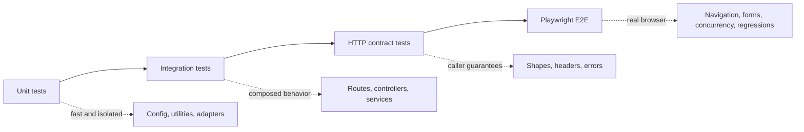

# How to test the browser service

The test suite separates fast logic checks from caller-visible contracts and real-browser workflows. Choose the lowest layer that proves the behavior.

## Test layers



| Layer | Location | Use it for |
|---|---|---|
| Unit | `src/__tests__/unit` | Parsing, validation, utilities, adapter-local behavior |
| Integration | `src/__tests__/integration` | Routes, controllers, use cases, and cross-module behavior |
| Contract | `src/__tests__/contract` | Public response shapes, headers, status codes, and error bodies |
| E2E | `src/__tests__/e2e` | Real Chromium flows, concurrency, recovery, and known regressions |

## Prerequisites

```bash
npm ci
npx playwright install chromium
```

Unit, integration, and contract suites use Vitest. End-to-end tests use Playwright Test with Chromium, serial file execution, two retries, and a 60-second test timeout.

## Commands

```bash
# Type-check production and test TypeScript.
npm run check

# All Vitest projects.
npm run test

# One Vitest project.
npm run test:unit
npm run test:integration
npm run test:contract

# High-value ownership and concurrency gate.
npm run test:gate:run-isolation

# Real-browser suite.
npm run test:e2e
```

Run one Vitest file:

```bash
npx vitest run src/__tests__/unit/config.unit.test.ts
```

Run one E2E spec:

```bash
npx playwright test src/__tests__/e2e/browser/snapshot-act-loop.e2e.spec.ts
```

## Coverage

```bash
npm run test:coverage
```

Coverage uses V8 and writes text, HTML, and LCOV reports under `coverage/`. `COVERAGE_PHASE` selects progressively stricter thresholds:

| Phase | Lines | Statements | Functions | Branches |
|---:|---:|---:|---:|---:|
| 1 | 35% | 35% | 60% | 65% |
| 2 | 50% | 50% | 65% | 70% |
| 3 | 70% | 70% | 70% | 70% |

Use `npm run test:coverage:phase1`, `phase2`, or `phase3` to select a gate explicitly.

## Adding a test

1. Put the test at the lowest layer that proves the behavior.
2. Reuse helpers, factories, and fixture pages from `src/__tests__`.
3. Assert observable output rather than private implementation details.
4. Add a contract test when an error code, header, status, or response shape changes.
5. Add a regression test with the fix when reproducing a production failure.
6. Run the focused test, its project, `npm run check`, and any affected higher-level suite.

See [test helper reference](../../src/__tests__/HELPERS.md) and [Contributing](../../CONTRIBUTING.md).
